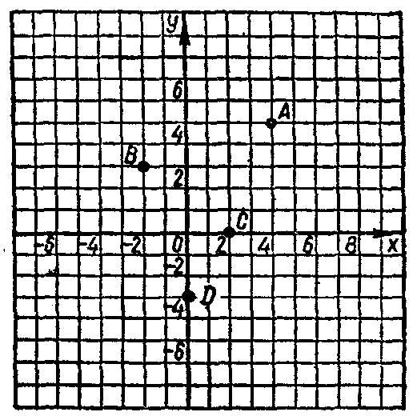

---
{
  "schema": "ld-s10y-lesson/page@3",
  "book": "6a",
  "page": 10,
  "printed_page": 4,
  "source": {
    "pdf": "6a 苏联十年制学校数学教材 代数 六年级.pdf",
    "pdf_sha256": "5bf4fa02c7478d22e88fb1029557fd986e7f1e862d53d449ba96bfc8cf5a3548",
    "pdf_page": 10
  },
  "render": {
    "dpi": 300,
    "w": 1473,
    "h": 2239,
    "sha256": "da12782bfcbfe8678437fa98d4c92c99e0c099266411398e819fbb53b4f8bb60"
  },
  "profile": {
    "id": "soviet-cn",
    "sha256": "dad8d974ba16880482f359073263269de8c405ccf8cb17dc4215fad11da44849"
  },
  "notes": [],
  "printed_lines": 15,
  "figures": [
    {
      "id": "fig-01",
      "label": "图 1",
      "box": [
        472,
        310,
        497,
        501
      ]
    }
  ],
  "provenance": {
    "cap": "1",
    "normalized": true
  }
}
---

<!-- fig 图 1 box 472,310,497,501 -->

<!-- cap 图 1 -->
图　1

<!-- ex 12 -->
一线段的端点是 $(-1,4)$ 和 $(2,-2)$，作这线段。写出这
线段同横轴和纵轴的交点的坐标。

<!-- h3 -->
2.　含有变量的式

<!-- p -->
式 $a(a+1)$ 含有变量 $a$，它的值的大小决定于变量 $a$ 所取
的值。例如，当 $a=2$ 时，因为 $2\cdot(2+1)=6$，所以式的值等于
6；当 $a=8$ 时，式的值等于 72；当 $a=-1$ 时，式的值等于零；
当 $a=0$ 时，式的值也是零。对应于变量 $a$ 的每一个值，式
$a(a+1)$ 有唯一的值。

<!-- p open -->
当 $p=4$ 时，式 $\frac{2p}{p-3}$ 的值等于 8。当 $p=1$ 时，它的值等于
$-1$。当 $p=3$ 时，这个式子没有意义。除了 $p=3$ 这种情况以
外，$p$ 取其他任何值时，式 $\frac{2p}{p-3}$ 的分母都不等于零，所以式子
都有意义。这就是说，除 3 以外所有数的集合是式 $\frac{2p}{p-3}$ 的定
义域。

<!-- foot -->
· 4 ·
