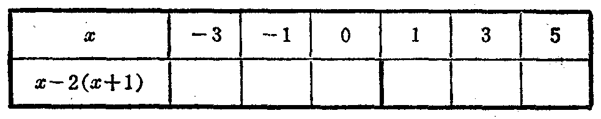
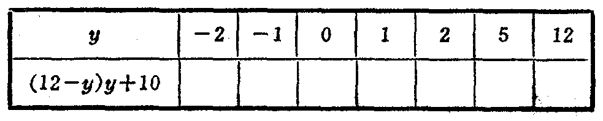

---
{
  "schema": "ld-s10y-lesson/page@3",
  "book": "6a",
  "page": 12,
  "printed_page": 6,
  "source": {
    "pdf": "6a 苏联十年制学校数学教材 代数 六年级.pdf",
    "pdf_sha256": "5bf4fa02c7478d22e88fb1029557fd986e7f1e862d53d449ba96bfc8cf5a3548",
    "pdf_page": 12
  },
  "render": {
    "dpi": 300,
    "w": 1473,
    "h": 2239,
    "sha256": "ca39ceab6a09f91b64a41f34ed043856f23302c7b8a0400fc55b70494bd83ca2"
  },
  "profile": {
    "id": "soviet-cn",
    "sha256": "dad8d974ba16880482f359073263269de8c405ccf8cb17dc4215fad11da44849"
  },
  "notes": [],
  "printed_lines": 21,
  "figures": [
    {
      "id": "tbl-p0012-01",
      "label": "表 а",
      "box": [
        310,
        1134,
        959,
        172
      ]
    },
    {
      "id": "tbl-p0012-02",
      "label": "表 б",
      "box": [
        311,
        1345,
        959,
        174
      ]
    }
  ],
  "provenance": {
    "cap": "1",
    "normalized": true
  }
}
---

<!-- ex 13 -->
求下列各式的值：
а) $9a(a-8)+135,\ a=3$；
б) $(p+0.6)(p-0.6),\ p=0.2$；
в) $k+\frac{2}{3}(k-\frac{2}{3}),\ k=\frac{1}{6}$；
г) $(3m+6)n,\ m=-\frac{1}{3},\ n=1.2$；
д) $\frac{a}{b}+3c,\ a=10,\ b=5,\ c=-\frac{1}{3}$；
е) $(a+b)(b+c)(c+d)(d+e),$
$a=0,\ b=1,\ c=2,\ d=3,\ e=4$.

<!-- ex 14 -->
变量 $x$ 的值等于 $-3$，求下列各式的值：
(1) $(2x-5)x+5$；　　　(2) $(2x-5)(x+5)$.

<!-- ex 15 open -->
填表：
а)

<!-- fig 表 а box 310,1134,959,172 owner-ex 15 -->

<!-- ex 15 cont -->
б)

<!-- fig 表 б box 311,1345,959,174 owner-ex 15 -->

<!-- ex 16 -->
已知 $b=-3,-1,0,1,3$，求式 $b^2-9$ 的值。对于变量 $b$
所取的值，式的值的集合是什么？

<!-- ex 17 -->
已知 $x\in Z$（$Z$ 表示整数集），求式 $(2x+4.3)\times0$ 的值的集
合。

<!-- ex 18 -->
求式 $a^2-2ab$ 的值：
а) $a=5,\ b=2$；
б) $a=2,\ b=5$.

<!-- foot -->
· 6 ·
