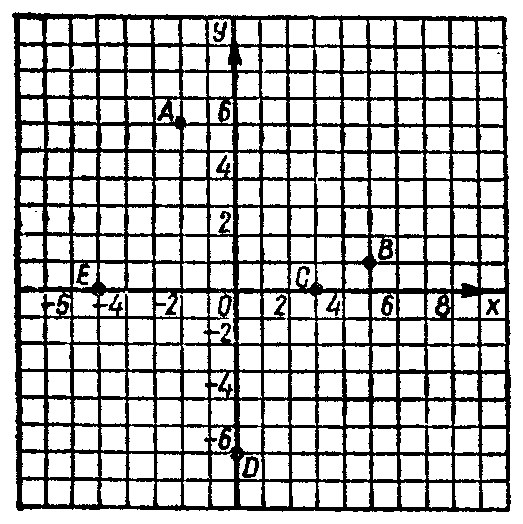
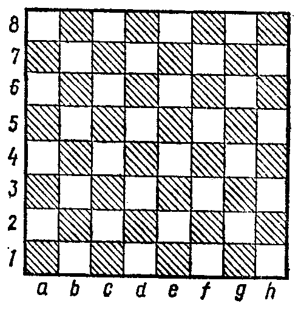

---
{
  "schema": "ld-s10y-lesson/page@3",
  "book": "6a",
  "page": 13,
  "printed_page": 7,
  "source": {
    "pdf": "6a 苏联十年制学校数学教材 代数 六年级.pdf",
    "pdf_sha256": "5bf4fa02c7478d22e88fb1029557fd986e7f1e862d53d449ba96bfc8cf5a3548",
    "pdf_page": 13
  },
  "render": {
    "dpi": 300,
    "w": 1473,
    "h": 2239,
    "sha256": "dd28b93c8f07e9d86b34baf98feecc94d400bab59c12426aec5a43b4f1543971"
  },
  "profile": {
    "id": "soviet-cn",
    "sha256": "dad8d974ba16880482f359073263269de8c405ccf8cb17dc4215fad11da44849"
  },
  "notes": [],
  "printed_lines": 19,
  "figures": [
    {
      "id": "fig-02",
      "label": "图 2",
      "box": [
        282,
        537,
        499,
        500
      ]
    },
    {
      "id": "fig-03",
      "label": "图 3",
      "box": [
        849,
        543,
        472,
        485
      ]
    }
  ],
  "provenance": {
    "cap": "1",
    "normalized": true
  }
}
---

<!-- ex 19 -->
已知变量 $m$ 和 $n$ 的值所组成的数对 $(m,n)$ 如下，求式
$3m-2n$ 的值：
а) $(5,3)$；　б) $(0,1)$；
в) $(2,4)$；　г) $(4,2)$.

<!-- fig 图 2 box 282,537,499,500 -->

<!-- fig 图 3 box 849,543,472,485 -->

<!-- cap 图 2 -->
图　2

<!-- cap 图 3 samerow -->
图　3

<!-- ex 20 -->
写出图 2 中点 $A,B,C,D,E$ 的坐标组成的数对。

<!-- ex 21 -->
图 3 是国际象棋的棋盘，它的每一格可以用一个字母和
一个数组成的数对表示。例如，右上角的方格是 $(h,8)$，
通常简单记作 $h8$。左下角的方格记作 $a1$。写出表示
下列各方格的数对的集合：
(1) 从左下角到右上角的对角线上各方格；
(2) 从左上角到右下角的对角线上各方格。

<!-- ex 22 -->
学校小吃部的早餐有两道饭菜：
第一道：肉饼，稀饭，酸奶。
第二道：茶，甜煮水果，果汁，牛奶。
由这些饭菜可以配成几种早餐吃法？用数对的集合的
形式写出答案。

<!-- ex 23 open -->
а) 下表中，顶上一行列出了 $x$ 的值，右边一行列出了 $y$

<!-- foot -->
· 7 ·
