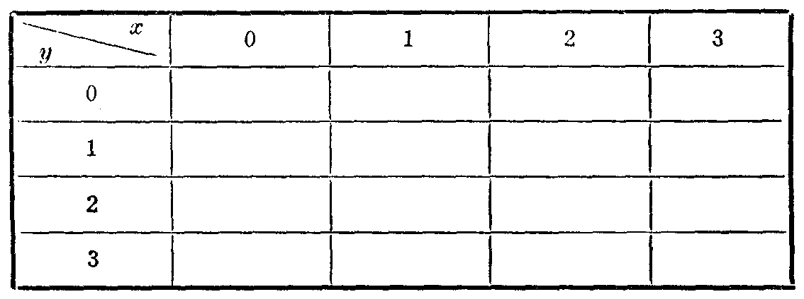
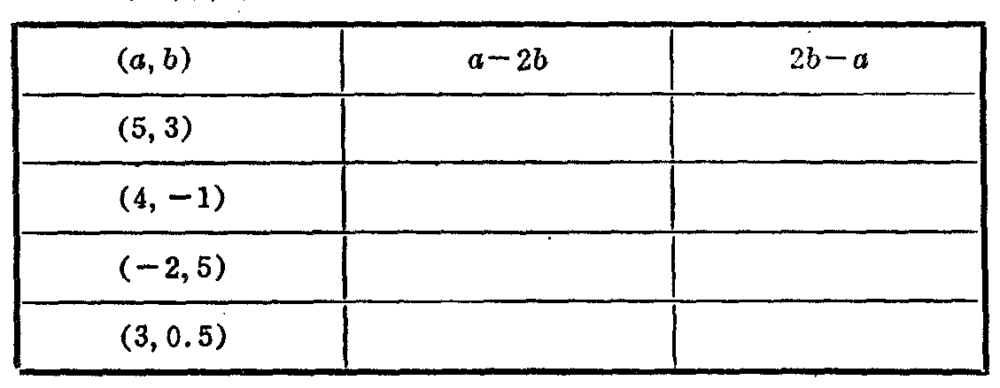

---
{
  "schema": "ld-s10y-lesson/page@3",
  "book": "6a",
  "page": 14,
  "printed_page": 8,
  "source": {
    "pdf": "6a 苏联十年制学校数学教材 代数 六年级.pdf",
    "pdf_sha256": "5bf4fa02c7478d22e88fb1029557fd986e7f1e862d53d449ba96bfc8cf5a3548",
    "pdf_page": 14
  },
  "render": {
    "dpi": 300,
    "w": 1473,
    "h": 2239,
    "sha256": "275efe53af6170539a94a719964f0674b7aed0d5564f08c320d729af472e6735"
  },
  "profile": {
    "id": "soviet-cn",
    "sha256": "dad8d974ba16880482f359073263269de8c405ccf8cb17dc4215fad11da44849"
  },
  "notes": [],
  "printed_lines": 13,
  "figures": [
    {
      "id": "tbl-p0014-01",
      "label": "表 а",
      "box": [
        147,
        347,
        1110,
        400
      ]
    },
    {
      "id": "tbl-p0014-02",
      "label": "表 б",
      "box": [
        156,
        1014,
        1105,
        415
      ]
    }
  ],
  "provenance": {
    "cap": "1",
    "normalized": true
  }
}
---

<!-- ex 23 cont open -->
的值。在空格处填入式 $x+y$ 的值：

<!-- fig 表 а box 147,347,1110,400 owner-ex 23 -->

<!-- ex 23 cont -->
对应于变量 $x$ 和 $y$ 的所组成的数对，式 $x+y$ 的值的集
合是什么？
б) 如果式是 $xy$，解答上面所提问题。

<!-- ex 24 open -->
а) 填表：

<!-- fig 表 б box 156,1014,1105,415 owner-ex 24 -->

<!-- ex 24 cont -->
б) 已知当变量 $a$ 和 $b$ 取一对值时，式 $a-2b$ 的值是
1.8。当变量 $a$ 和 $b$ 仍取这一对值时，式 $2b-a$ 取什么
值呢？

<!-- ex 25 -->
当 $y$ 取什么值时，下列各式没有意义？
а) $\frac{1}{y-7}$；　　б) $\frac{7y}{3+y}$；　　в) $\frac{18}{y}$；　　г) $\frac{2y+14}{2y-14}$.

<!-- ex 26 open -->
求下列各式的定义域：
а) $\frac{12}{x-4}$；　　б) $\frac{3a}{2-a}$；　　в) $\frac{b+7}{b}$；

<!-- foot -->
· 8 ·
