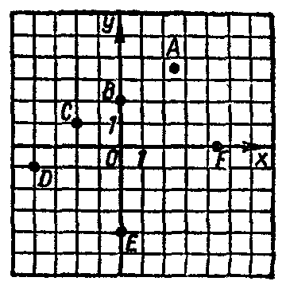

---
{
  "schema": "ld-s10y-lesson/page@3",
  "book": "6a",
  "page": 15,
  "printed_page": 9,
  "source": {
    "pdf": "6a 苏联十年制学校数学教材 代数 六年级.pdf",
    "pdf_sha256": "5bf4fa02c7478d22e88fb1029557fd986e7f1e862d53d449ba96bfc8cf5a3548",
    "pdf_page": 15
  },
  "render": {
    "dpi": 300,
    "w": 1473,
    "h": 2239,
    "sha256": "52837624ea0ca7e98391e80d002fb578a1530f32a5ae48820079e22f83d7604c"
  },
  "profile": {
    "id": "soviet-cn",
    "sha256": "dad8d974ba16880482f359073263269de8c405ccf8cb17dc4215fad11da44849"
  },
  "notes": [],
  "printed_lines": 24,
  "figures": [
    {
      "id": "fig-04",
      "label": "图 4",
      "box": [
        1018,
        1536,
        336,
        339
      ]
    }
  ],
  "provenance": {
    "cap": "1",
    "normalized": true
  }
}
---

<!-- ex 26 cont -->
г) $5(y+2)$；　　д) $\frac{12x+7}{10}$.

<!-- ex 27 -->
а) 找出变量 $a$ 和 $b$ 的一对数值，分别使下列各式没有
意义：
1) $\frac{17}{a-b}$；　　2) $\frac{34}{a+b}$；　　3) $\frac{4}{a-2b}$；　　4) $\frac{6a}{2b+a}$.
б) 指出使下列式子有意义时变量 $m$ 和 $n$ 的值所组成的
数对集合：
1) $\frac{57}{m-n}$；　　　　　2) $-\frac{128}{m+n}$.

<!-- ex 28 -->
用列出元素的方法给出集合：
а) $\{x\mid x\in N,\ x<13\}$；　　　б) $\{a\mid a\in Z,\ -5<a<5\}$；
в) $\{p\mid p\in N,\ p\text{ 是 }12\text{ 的因数}\}$；　г) $\{y\mid y\in Z,\ |y|=8\}$.

<!-- ex 29 -->
下面变量 $x$ 和 $y$ 的值所组成的数对属于集合
$\{(x,y)\mid x<y\}$ 吗？
а) $(7,11)$；　　　　　　б) $(3,8)$；
в) $(-3,-4)$；　　　　　г) $(\frac{1}{4},\frac{1}{3})$.

<!-- exhead -->
复习题

<!-- ex 30 -->
图 4 上画出了 $A,B,C,D,E,F$ 六点。
а) 哪些点的横坐标是正的？
б) 哪些点的横坐标是负的？
в) 哪些点的纵坐标是正的？
г) 哪些点的纵坐标是负的？

<!-- fig 图 4 box 1018,1536,336,339 -->

<!-- cap 图 4 samerow -->
图　4

<!-- ex 31 open -->
已知矩形 $ABCD$ 的三个顶点的
坐标是：
$A(-2,1),\ B(-2,4),\ C(3,4)$，

<!-- foot -->
· 9 ·
