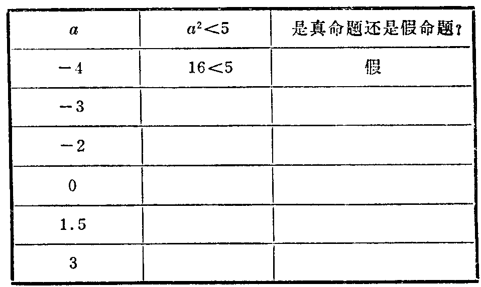
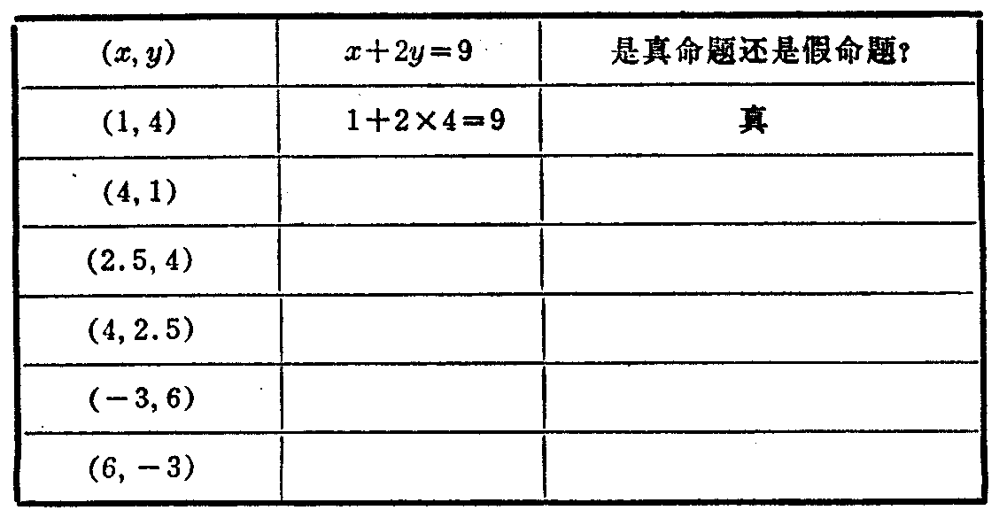

---
{
  "schema": "ld-s10y-lesson/page@3",
  "book": "6a",
  "page": 18,
  "printed_page": 12,
  "source": {
    "pdf": "6a 苏联十年制学校数学教材 代数 六年级.pdf",
    "pdf_sha256": "5bf4fa02c7478d22e88fb1029557fd986e7f1e862d53d449ba96bfc8cf5a3548",
    "pdf_page": 18
  },
  "render": {
    "dpi": 300,
    "w": 1473,
    "h": 2239,
    "sha256": "35208fbe4433db8d4e79d5cb2f2b24ee81d0b2701f09251141f17e32d56ecd7c"
  },
  "profile": {
    "id": "soviet-cn",
    "sha256": "dad8d974ba16880482f359073263269de8c405ccf8cb17dc4215fad11da44849"
  },
  "notes": [],
  "printed_lines": 8,
  "figures": [
    {
      "id": "tbl-p0018-01",
      "label": "表",
      "box": [
        268,
        460,
        934,
        549
      ]
    },
    {
      "id": "tbl-p0018-02",
      "label": "表",
      "box": [
        189,
        1345,
        1104,
        561
      ]
    }
  ],
  "provenance": {
    "cap": "1",
    "normalized": true
  }
}
---

<!-- ex 36 cont -->
г) $(90.9\div3.03)\left(\frac13-\frac56\right)>-1$。

<!-- ex 37 -->
填表（真命题记作“真”，假命题记作“假”）：

<!-- fig 表 box 268,460,934,549 owner-ex 37 -->

<!-- ex 38 -->
从集合 $\{-10,-8,-6,-1,1,12,15\}$ 中，找出使下列语
句变成真命题的数所组成的子集。
а) $\frac{48}{x}$ 是整数；　　　　　　б) $1+x$ 是正数。

<!-- ex 39 -->
填表（真命题记作“真”，假命题记作“假”）：

<!-- fig 表 box 189,1345,1104,561 owner-ex 39 -->

<!-- ex 40 open -->
指出变量 $n$ 的一个值，当 $n$ 取这个值时语句变成真

<!-- foot -->
· 12 ·
