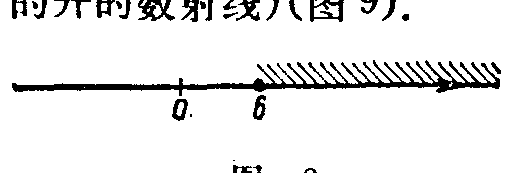

---
{
  "schema": "ld-s10y-lesson/page@3",
  "book": "6a",
  "page": 25,
  "printed_page": 19,
  "source": {
    "pdf": "6a 苏联十年制学校数学教材 代数 六年级.pdf",
    "pdf_sha256": "5bf4fa02c7478d22e88fb1029557fd986e7f1e862d53d449ba96bfc8cf5a3548",
    "pdf_page": 25
  },
  "render": {
    "dpi": 300,
    "w": 1473,
    "h": 2239,
    "sha256": "ce13f79750623a6508a49736afe288cf5c3a9d937757c1f0781f556531e1bee5"
  },
  "profile": {
    "id": "soviet-cn",
    "sha256": "dad8d974ba16880482f359073263269de8c405ccf8cb17dc4215fad11da44849"
  },
  "notes": [],
  "printed_lines": 19,
  "figures": [
    {
      "id": "fig-07",
      "label": "图 7",
      "box": [
        237,
        357,
        1084,
        101
      ]
    },
    {
      "id": "fig-08",
      "label": "图 8",
      "box": [
        234,
        861,
        489,
        149
      ]
    },
    {
      "id": "fig-09",
      "label": "图 9",
      "box": [
        832,
        926,
        486,
        62
      ]
    },
    {
      "id": "fig-10",
      "label": "图 10",
      "box": [
        263,
        1308,
        501,
        56
      ]
    },
    {
      "id": "fig-11",
      "label": "图 11",
      "box": [
        831,
        1316,
        494,
        62
      ]
    },
    {
      "id": "fig-12",
      "label": "图 12",
      "box": [
        803,
        1554,
        495,
        63
      ]
    }
  ],
  "provenance": {
    "cap": "1",
    "normalized": true
  }
}
---

<!-- p cont -->
做左开数线段。

<!-- fig 图 7 box 237,357,1084,101 -->

<!-- cap 图 7 -->
图 7

<!-- p -->
对于不等式 $x\ge6$ 来说，6 和数轴上 6 右边的点（图 8）的
坐标都满足不等式。不等式 $x\ge6$ 的解集合记作 $[6,+\infty[$，叫
做数射线（读作：从 6 到无穷大的数射线）。不等式 $x>6$ 的
解集合记作 $]6,+\infty[$，叫做开的数射线（读作：从 6 到无穷大
的开的数射线）（图 9）。

<!-- fig 图 8 box 234,861,489,149 -->

<!-- cap 图 8 -->
图 8

<!-- fig 图 9 box 832,926,486,62 -->

<!-- cap 图 9 samerow -->
图 9

<!-- p -->
不等式 $x\le6$ 和 $x<6$ 的解集合（图 10 和图 11）分别记作
$]-\infty,6]$ 和 $]-\infty,6[$（读作：从负无穷大到 6 的数射线和从
负无穷大到 6 的开的数射线）。

<!-- fig 图 10 box 263,1308,501,56 -->

<!-- cap 图 10 -->
图 10

<!-- fig 图 11 box 831,1316,494,62 -->

<!-- cap 图 11 samerow -->
图 11

<!-- p -->
对于不等式 $x^2>-5$ 来说，任何一个数都满足这个不等
式。它的解集合叫做数轴，记作 $]-\infty,+\infty[$（图 12）。

<!-- fig 图 12 box 803,1554,495,63 -->

<!-- cap 图 12 -->
图 12

<!-- p -->
$[3,7]$，$]3,7]$，$[3,7[$，$]3,7[$，$[6,+\infty[$，$]6,+\infty[$，
$]-\infty,6]$，$]-\infty,6[$，$]-\infty,+\infty[$，这样的集合都叫做数区间。

<!-- ex 69 open -->
变量 $y$ 取下列数值时它是不等式 $y^2>y+6$ 的解吗？

<!-- foot -->
· 19 ·
