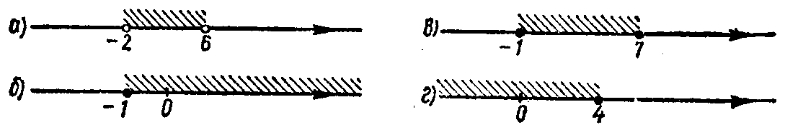

---
{
  "schema": "ld-s10y-lesson/page@3",
  "book": "6a",
  "page": 26,
  "printed_page": 20,
  "source": {
    "pdf": "6a 苏联十年制学校数学教材 代数 六年级.pdf",
    "pdf_sha256": "5bf4fa02c7478d22e88fb1029557fd986e7f1e862d53d449ba96bfc8cf5a3548",
    "pdf_page": 26
  },
  "render": {
    "dpi": 300,
    "w": 1473,
    "h": 2239,
    "sha256": "e772cfa0009e7c546fdd67c577bac7186339a327936d145c794783cfe3fcc2f5"
  },
  "profile": {
    "id": "soviet-cn",
    "sha256": "dad8d974ba16880482f359073263269de8c405ccf8cb17dc4215fad11da44849"
  },
  "notes": [],
  "printed_lines": 24,
  "figures": [
    {
      "id": "fig-13",
      "label": "图 13",
      "box": [
        180,
        734,
        1065,
        161
      ]
    }
  ],
  "provenance": {
    "cap": "1",
    "normalized": true
  }
}
---

<!-- ex 69 cont -->
а) 8；　　б) $-2$；　　в) $\frac13$；　　г) 2.5。

<!-- ex 70 -->
说出下列不等式的任何两个解：
а) $x+4>12$；　　　　б) $2x>7$。

<!-- ex 71 -->
说出下列不等式的任何一个解：
а) $a^2>a$；　　　　 б) $a^2<a$。

<!-- ex 72 -->
说出图 13 中表示的数区间：

<!-- fig 图 13 box 180,734,1065,161 owner-ex 72 -->

<!-- cap 图 13 -->
图 13

<!-- ex 73 -->
在数轴上表示数区间并且读出来：
а) $[3,+\infty[$；　б) $[-2,4]$；　в) $]-\infty,2[$；
г) $]-3,3[$；　　　д) $[0,5[$；　　е) $]-4,0]$。

<!-- ex 74 -->
在数轴上表示下列不等式的解集合，并且用数区间的记
号写出来：
а) $x\ge-2$；　б) $x\le3$；　в) $x>8$；
г) $x<-5$；　　д) $-1\le x\le4$；　е) $-2<x<1$；
ж) $-5\le x<-3$；　з) $2<x\le6$。

<!-- ex 75 -->
下列各数属于数区间 $]-4,6.5[$ 吗？
$-3$，$-5$，5，6.5，$-3.9$，$-4.1$。

<!-- ex 76 -->
说出属于下列数区间的两个正数和两个负数：
а) $]-4,5[$；　　　　б) $[-1,1]$。

<!-- ex 77 -->
哪几个整数属于下列数区间？
а) $[0,8]$；　б) $]-3,3[$；　в) $[-5,3[$；　г) $]-4,8]$。

<!-- ex 78 open -->
说出属于下列数区间的最大整数：
а) $[-12,-9]$；　　　б) $[-1,17[$；

<!-- foot -->
· 20 ·
