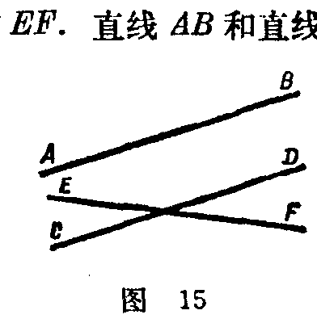

---
{
  "schema": "ld-s10y-lesson/page@3",
  "book": "6a",
  "page": 28,
  "printed_page": 22,
  "source": {
    "pdf": "6a 苏联十年制学校数学教材 代数 六年级.pdf",
    "pdf_sha256": "5bf4fa02c7478d22e88fb1029557fd986e7f1e862d53d449ba96bfc8cf5a3548",
    "pdf_page": 28
  },
  "render": {
    "dpi": 300,
    "w": 1473,
    "h": 2239,
    "sha256": "34ea224f445133297d6654b3d269db84d2d91f9cc056fb792b7048e0e7771f18"
  },
  "profile": {
    "id": "soviet-cn",
    "sha256": "dad8d974ba16880482f359073263269de8c405ccf8cb17dc4215fad11da44849"
  },
  "notes": [
    "页顶有一行反面透印污迹，为行数对账记作 foot，不进入装订。"
  ],
  "printed_lines": 26,
  "figures": [
    {
      "id": "fig-15",
      "label": "图 15",
      "box": [
        890,
        908,
        368,
        376
      ]
    }
  ],
  "provenance": {
    "cap": "1",
    "normalized": true
  }
}
---

<!-- foot -->
·

<!-- ex 86 -->
а) 三角形中一边的边长等于另一边边长的两倍，但比
第三边小 $3\text{ cm}$。已知三角形的周长是 $33\text{ cm}$，求三角形
各边的长。
б) 沿矩形的运动场周围筑一道围墙，长 $320\text{ m}$。已知运
动场的长比宽多 $4\text{ m}$，求运动场的面积。

<!-- h2 -->
§3.　关系

<!-- h3 -->
6.　关系的概念

<!-- p -->
图 15 上画了三条直线 $AB$、$CD$ 和 $EF$。直线 $AB$ 和直线
$CD$ 平行。我们可以换一种说法：直
线 $AB$ 和直线 $CD$ 的关系是平行关系。

<!-- fig 图 15 box 890,908,368,376 -->

<!-- cap 图 15 -->
图 15

<!-- p -->
取两个数，30 和 40。30 小于 40。
换句话说，30 和 40 这两个数之间的
关系是“小于”关系。

<!-- p -->
在数学教科书里，我们还看到过其他的一些关系，例如平
面上直线的垂直关系，几何图形的全等关系，数的相等关系。

<!-- p -->
为了表示各种关系，常采用特别的符号：
$\parallel,\perp,\cong,=,<,>,\le,\ge$，等等。

<!-- p -->
$\triangle ABC\cong\triangle KLM$，这种写法表示三角形 $ABC$ 和三角形
$KLM$ 的关系是全等关系。$a\perp b$ 表示直线 $a$ 和直线 $b$ 的关系
是垂直关系。

<!-- p -->
我们看到，当讨论一种关系时，总要涉及到处于这种关系
当中的两个元素（元素对）。

<!-- p -->
下面举几个例子较详细地讨论几种关系。

<!-- foot -->
· 22 ·
