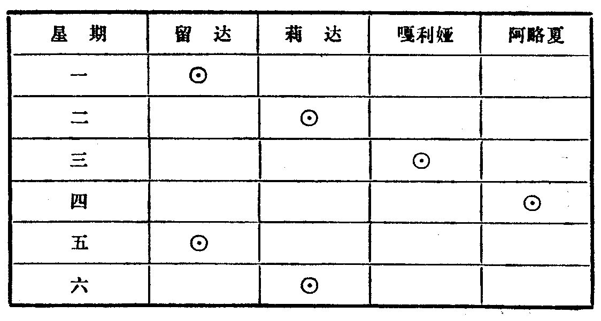

---
{
  "schema": "ld-s10y-lesson/page@3",
  "book": "6a",
  "page": 32,
  "printed_page": 26,
  "source": {
    "pdf": "6a 苏联十年制学校数学教材 代数 六年级.pdf",
    "pdf_sha256": "5bf4fa02c7478d22e88fb1029557fd986e7f1e862d53d449ba96bfc8cf5a3548",
    "pdf_page": 32
  },
  "render": {
    "dpi": 300,
    "w": 1473,
    "h": 2239,
    "sha256": "e27fc3757284ac1a34f08d677c068262c0c3c289b5e16f9fde9346ec4ec73f74"
  },
  "profile": {
    "id": "soviet-cn",
    "sha256": "dad8d974ba16880482f359073263269de8c405ccf8cb17dc4215fad11da44849"
  },
  "notes": [],
  "printed_lines": 18,
  "figures": [
    {
      "id": "tbl-p0032-01",
      "label": "表",
      "box": [
        171,
        1241,
        1100,
        577
      ]
    }
  ],
  "provenance": {
    "cap": "1",
    "normalized": true
  }
}
---

<!-- ex 90 cont -->
给出：
а) $x$ 等于 $y$ 的两倍，其中 $x\in M,y\in M$；
б) $x$ 能被 $y$ 整除，其中 $x\in M,y\in M$。
用箭头号表示这种关系。

<!-- ex 91 -->
语句“$x$ 是 $y$ 的约数”（其中 $x\in N,y\in N$）给出了自然数之
间的一种关系。说出几个具有这种关系的自然数对。第
一个元素是 5，指出三个数对 $(x,y)$ 来。第二个元素是
12，写出所有这种数对来。

<!-- ex 92 -->
设 $A=\{$涅瓦河，伏尔加河，第聂伯河，乌拉尔河，勒拿
河$\}$ 是河流的集合，$B=\{$黑海，里海，波罗的海$\}$ 是海的
集合。语句“河 $x$ 流入海 $y$”（其中 $x\in A,y\in B$）给出了集
合 $A$ 和 $B$ 的元素间的一种关系。写出这种关系的元素
对的集合。

<!-- ex 93 open -->
少先队员留达、莉达、嘎利娅和阿略夏画了一周的值
日表：

<!-- fig 表 box 171,1241,1100,577 owner-ex 93 -->

<!-- ex 93 cont open -->
在少先队员集合 $\{$留达，莉达，嘎利娅，阿略夏$\}$ 的元素和
每周教学日集合 $\{$星期一，星期二，星期三，星期四，星期

<!-- foot -->
· 26 ·
