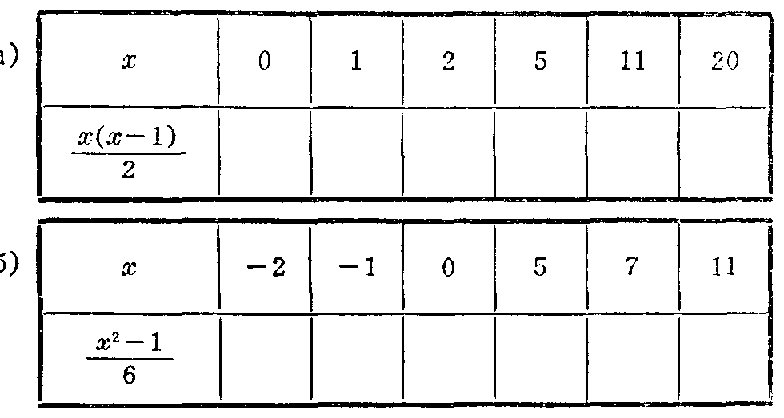
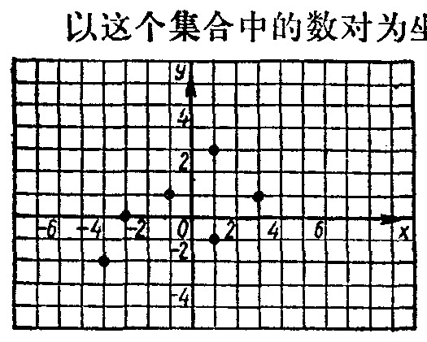
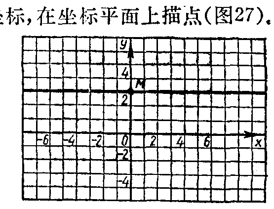

---
{
  "schema": "ld-s10y-lesson/page@3",
  "book": "6a",
  "page": 35,
  "printed_page": 29,
  "source": {
    "pdf": "6a 苏联十年制学校数学教材 代数 六年级.pdf",
    "pdf_sha256": "5bf4fa02c7478d22e88fb1029557fd986e7f1e862d53d449ba96bfc8cf5a3548",
    "pdf_page": 35
  },
  "render": {
    "dpi": 300,
    "w": 1473,
    "h": 2239,
    "sha256": "6e0e802776dadd80aede188742435ffbe7caa79cec0fd06820efc90c52ddf104"
  },
  "profile": {
    "id": "soviet-cn",
    "sha256": "dad8d974ba16880482f359073263269de8c405ccf8cb17dc4215fad11da44849"
  },
  "notes": [],
  "printed_lines": 13,
  "figures": [
    {
      "id": "tbl-p0035-01",
      "label": "表",
      "box": [
        349,
        256,
        956,
        499
      ]
    },
    {
      "id": "fig-27",
      "label": "图 27",
      "box": [
        259,
        1504,
        501,
        397
      ]
    },
    {
      "id": "fig-28",
      "label": "图 28",
      "box": [
        794,
        1505,
        531,
        399
      ]
    }
  ],
  "provenance": {
    "cap": "1",
    "normalized": true
  }
}
---

<!-- fig 表 box 349,256,956,499 owner-ex 101 -->

<!-- ex 102 -->
$x$ 轴和 $y$ 轴把坐标平面分成四个象限（图 26）。下列各
点分别属于哪个象限？
$A(5,3)$，$B(-1.5,-7)$，$C(2.8,-7.6)$，$D(-4,0.81)$，
$E(-102,-87.6)$，$F(963,-49.3)$。

<!-- ex 103 -->
利用乘法分配律求式的值：
$0.618\times27.2+0.618\times72.8$。

<!-- h3 -->
7.　数和数之间的关系的图象

<!-- p -->
集合 $X=\{-4,-3,-1,1,3\}$ 和 $Y=\{-2,-1,0,1,3\}$ 的
元素间的关系 $h$，用数对的集合表示如下：
$\{(-4,-2),(-3,0),(-1,1),(1,3),(3,1),(1,-1)\}$。
以这个集合中的数对为坐标，在坐标平面上描点（图 27）。

<!-- fig 图 27 box 259,1504,501,397 -->

<!-- cap 图 27 -->
图 27

<!-- fig 图 28 box 794,1505,531,399 -->

<!-- cap 图 28 samerow -->
图 28

<!-- foot -->
· 29 ·
