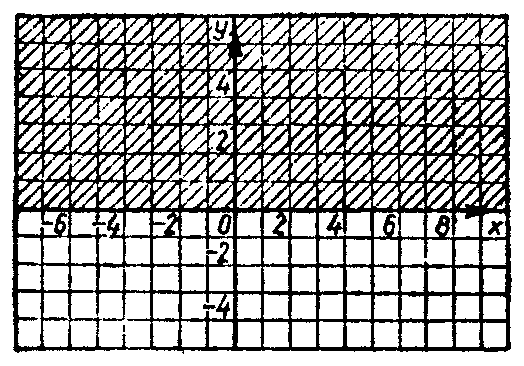
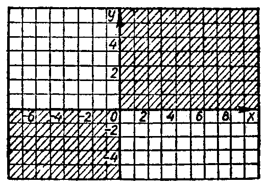

---
{
  "schema": "ld-s10y-lesson/page@3",
  "book": "6a",
  "page": 36,
  "printed_page": 30,
  "source": {
    "pdf": "6a 苏联十年制学校数学教材 代数 六年级.pdf",
    "pdf_sha256": "5bf4fa02c7478d22e88fb1029557fd986e7f1e862d53d449ba96bfc8cf5a3548",
    "pdf_page": 36
  },
  "render": {
    "dpi": 300,
    "w": 1473,
    "h": 2239,
    "sha256": "7e9ddfcc94eb40d12d1a5b064edd3054546239266cbfb51c1ab2deb6cd71c11b"
  },
  "profile": {
    "id": "soviet-cn",
    "sha256": "dad8d974ba16880482f359073263269de8c405ccf8cb17dc4215fad11da44849"
  },
  "notes": [],
  "printed_lines": 20,
  "figures": [
    {
      "id": "fig-29",
      "label": "图 29",
      "box": [
        196,
        1128,
        500,
        342
      ]
    },
    {
      "id": "fig-30",
      "label": "图 30",
      "box": [
        765,
        1126,
        499,
        343
      ]
    }
  ],
  "provenance": {
    "cap": "1",
    "normalized": true
  }
}
---

<!-- p -->
坐标平面上描得的点的集合，叫做关系 $h$ 的图象。

<!-- p -->
下面我们举例说明一些关系的图象。

<!-- p -->
例 1。用元素对 $\{(x,y)\mid x\text{ 是任意数},y=3\}$ 给出关系 $f$，其中 $x$ 是任意
数，$y=3$。关系 $f$ 的图象是过点 $M(0,3)$ 且平行于 $x$ 轴的直
线（图 28）。事实上，直线上任一点的纵坐标都等于 3，而平面
上其他点的纵坐标都不等于 3。

<!-- p -->
例 2。用数对的集合 $\{(x,y)\mid x\text{ 是任意数},y\ge0\}$ 给出关系
$g$。我们来作关系 $g$ 的图象。

<!-- p -->
纵坐标为正的点在 $x$ 轴以上，纵坐标等于零的点在 $x$ 轴
上。坐标轴下面的点，纵坐标为负。因此，关系 $g$ 的图象只能
是 $x$ 轴以上和 $x$ 轴上的点。这就是说，关系 $g$ 的图象（图 29）
是上半平面（包括分界线 $x$ 轴）。

<!-- fig 图 29 box 196,1128,500,342 -->

<!-- cap 图 29 -->
图 29

<!-- p -->
例 3。用数对的集合 $\{(x,y)\mid x\text{ 和 }y\text{ 是任意数},xy>0\}$ 给
出数之间的关系。

<!-- p -->
这个关系的图象是由坐标平面上所有横坐标和纵坐标符
号相同的点组成的。这就是说，这个关系的图象是第一、三象
限（不包括边线）的并集（图 30）。

<!-- fig 图 30 box 765,1126,499,343 -->

<!-- cap 图 30 samerow -->
图 30

<!-- p open -->
应当注意的是，坐标平面上任一点集都可以看作是这些

<!-- foot -->
· 30 ·
