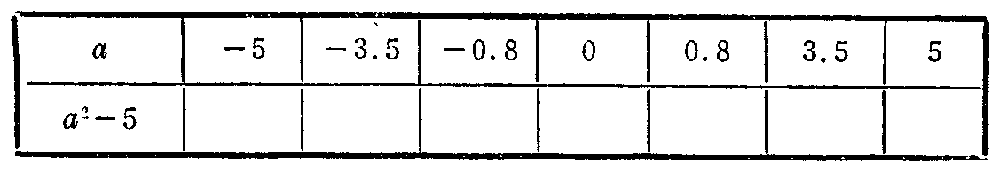
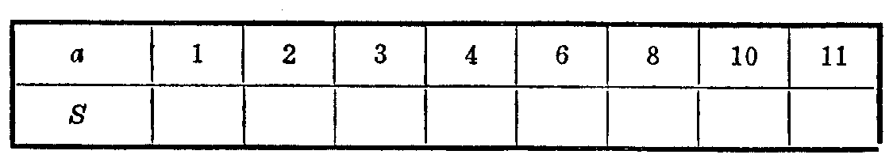

---
{
  "schema": "ld-s10y-lesson/page@3",
  "book": "6a",
  "page": 40,
  "printed_page": 34,
  "source": {
    "pdf": "6a 苏联十年制学校数学教材 代数 六年级.pdf",
    "pdf_sha256": "5bf4fa02c7478d22e88fb1029557fd986e7f1e862d53d449ba96bfc8cf5a3548",
    "pdf_page": 40
  },
  "render": {
    "dpi": 300,
    "w": 1473,
    "h": 2239,
    "sha256": "14157f8ce8880a7e01a68127bfe70a18cf1500e7bdb7974ec99bb7d70f3070b4"
  },
  "profile": {
    "id": "soviet-cn",
    "sha256": "dad8d974ba16880482f359073263269de8c405ccf8cb17dc4215fad11da44849"
  },
  "notes": [],
  "printed_lines": 16,
  "figures": [
    {
      "id": "tbl-p0040-01",
      "label": "表",
      "box": [
        182,
        1097,
        1103,
        170
      ]
    },
    {
      "id": "tbl-p0040-02",
      "label": "表",
      "box": [
        185,
        1430,
        1101,
        181
      ]
    }
  ],
  "provenance": {
    "cap": "1",
    "normalized": true
  }
}
---

<!-- exhead -->
第 2 小节

<!-- ex 118 -->
求式的值：
а) $\frac{m}{m-1}$，当 $m=-\frac13$；
б) $\frac{a^2+1}{a-4}$，当 $a=3.5$；
в) $\frac{ab-1}{(a+1)(b+1.6)}$，当 $a=-1.5,b=3.2$；
г) $\frac{2c+3d}{c+d}$，当 $c=-1.2,d=1.3$。

<!-- ex 119 -->
设 $a=0.45,b=-0.2$，比较下列各式的值的大小：
$a-2b(a+b)$，$(a-2b)(a+b)$，$(a-2b)a+b$。

<!-- ex 120 -->
填表：

<!-- fig 表 box 182,1097,1103,170 owner-ex 120 -->

<!-- ex 121 -->
矩形周长 $24\text{ dm}$，底长 $a\text{ dm}$。列出求矩形面积 $S$（单位：
$\text{dm}^2$）的公式，并填表：

<!-- fig 表 box 185,1430,1101,181 owner-ex 121 -->

<!-- ex 122 open -->
用列出集合元素的方法写出下列集合：
а) $\{p\mid p\text{ 是质数},20<p<40\}$；
б) $\{m\mid m\in N,\frac{12}{m}\text{ 是自然数}\}$；
в) $\{a\mid a\in N,\frac a7\text{ 是真分数}\}$；

<!-- foot -->
· 34 ·
