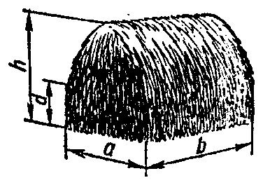
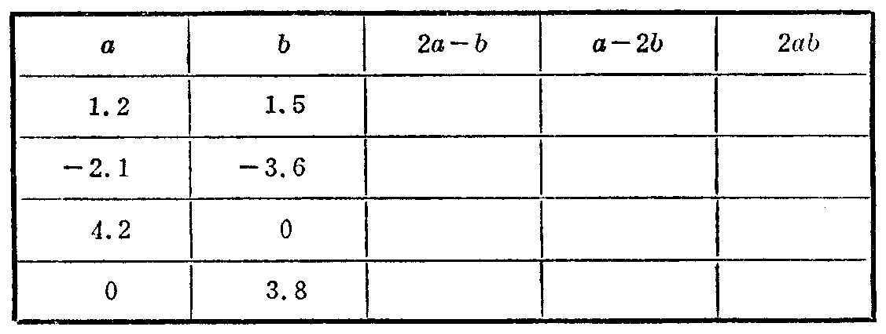

---
{
  "schema": "ld-s10y-lesson/page@3",
  "book": "6a",
  "page": 41,
  "printed_page": 35,
  "source": {
    "pdf": "6a 苏联十年制学校数学教材 代数 六年级.pdf",
    "pdf_sha256": "5bf4fa02c7478d22e88fb1029557fd986e7f1e862d53d449ba96bfc8cf5a3548",
    "pdf_page": 41
  },
  "render": {
    "dpi": 300,
    "w": 1473,
    "h": 2239,
    "sha256": "6d30a0d57042e3ebc59fe9d90cd18105ad32722e0e4456c581ad25bbcd5c34d6"
  },
  "profile": {
    "id": "soviet-cn",
    "sha256": "dad8d974ba16880482f359073263269de8c405ccf8cb17dc4215fad11da44849"
  },
  "notes": [],
  "printed_lines": 19,
  "figures": [
    {
      "id": "fig-33",
      "label": "图 33",
      "box": [
        942,
        878,
        352,
        240
      ]
    },
    {
      "id": "tbl-p0041-02",
      "label": "表",
      "box": [
        231,
        1219,
        1103,
        402
      ]
    }
  ],
  "provenance": {
    "cap": "1",
    "normalized": true
  }
}
---

<!-- ex 122 cont -->
г) $\{b\mid b\in N,\frac6b\text{ 是假分数}\}$。

<!-- ex 123 -->
已知变量 $n$ 取值的集合是自然数集。下列各式的值的
集合是什么？
а) $2n$；　　б) $2n-1$；　　в) $-n$。

<!-- ex 124 -->
已知变量 $x$ 取值集合是所有数的集合，$P$ 是式 $x^2+1$ 对
应值的集合。а) 有一个负数属于集合 $P$ 吗？б) 0 属
于集合 $P$ 吗？

<!-- ex 125 -->
计算图 33 上表示的草垛体积的公式是 $V=\frac{d+h}{2}ab$，其
中 $V$ 是草垛的体积（单位：立方
米），$a,b,d$ 和 $h$ 是草垛的尺寸
（单位：米）。设 $a=6.2,b=18$，
$h=4.8,d=3.2$，求 $V$。

<!-- fig 图 33 box 942,878,352,240 owner-ex 125 -->

<!-- cap 图 33 -->
图 33

<!-- ex 126 samerow -->
填表：

<!-- fig 表 box 231,1219,1103,402 owner-ex 126 -->

<!-- ex 127 open -->
列式解应用题：
а) $A$ 城和 $B$ 城相距 $620\text{ km}$。从 $A$ 城和 $B$ 城同时相向
开出两辆小轿车，一辆的速度是 $v\text{ km/h}$，另一辆是
$w\text{ km/h}$。经过几小时后两车相遇？
б) 自行车 $a$ 小时走 $30\text{ km}$，摩托车 $b$ 小时走同样距离。

<!-- foot -->
· 35 ·
