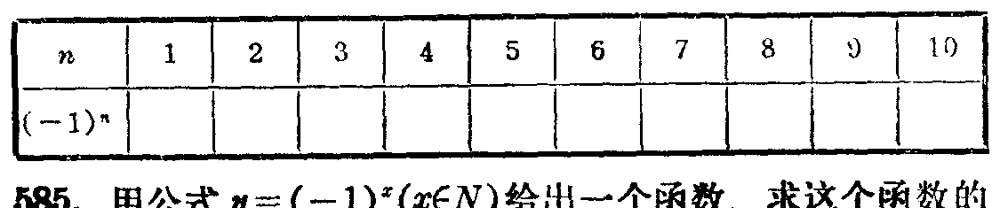

---
{
  "schema": "ld-s10y-lesson/page@3",
  "book": "6a",
  "page": 165,
  "printed_page": 159,
  "source": {
    "pdf": "6a 苏联十年制学校数学教材 代数 六年级.pdf",
    "pdf_sha256": "5bf4fa02c7478d22e88fb1029557fd986e7f1e862d53d449ba96bfc8cf5a3548",
    "pdf_page": 165
  },
  "render": {
    "dpi": 300,
    "w": 1473,
    "h": 2239,
    "sha256": "be3a87511870aa21a5299597c57b7b2a20df98e43f1d38d2c9890c1bd08d9750"
  },
  "profile": {
    "id": "soviet-cn",
    "sha256": "dad8d974ba16880482f359073263269de8c405ccf8cb17dc4215fad11da44849"
  },
  "notes": [],
  "printed_lines": 22,
  "figures": [
    {
      "id": "tbl-p0165-01",
      "label": "表",
      "box": [
        222,
        1299,
        1101,
        211
      ]
    }
  ],
  "provenance": {
    "cap": "1",
    "normalized": true
  }
}
---

<!-- p cont -->
$(-2)^{10}=((-2)^2)^5=4^5=1024$，
$(-3)^7=(-3)^6\cdot(-3)=729\cdot(-3)=-2187$．

<!-- ex 578 -->
578．把下列各式写成底数$x$的幂的形式：
а）$(x^3)^2$；　б）$(x^4)^3$；　в）$(x^5)^4$；　г）$(x^4)^5$．

<!-- ex 579 -->
579．写成底数$y$的幂的形式：
а）$(y^2)^5$；　б）$y^2y^5$；　в）$(y^{10})^3$；　г）$y^{10}y^3$．

<!-- ex 580 -->
580．写成底数$b$的幂的形式：
а）$(b^k)^4$，其中$k\in N$；
б）$b^kb^4$，其中$k\in N$．

<!-- ex 581 -->
581．把$2^{20}$写成下列底数的幂的形式：
а）$2^2$；　б）$2^4$；　в）$2^5$；　г）$2^{10}$．

<!-- ex 582 -->
582．把$2^{60}$写成下列底数的幂的形式：
а）$4$；　б）$8$；　в）$16$；　г）$32$．

<!-- ex 583 -->
583．用所有方法把$a^{12}$写成幂的形式．

<!-- ex 584 -->
584．填表：

<!-- fig 表 box 222,1299,1101,211 owner-ex 584 -->

<!-- ex 585 -->
585．用公式$y=(-1)^x$（$x\in N$）给出一个函数．求这个函数的
值域．

<!-- ex 586 -->
586．比较两个式子的值的大小：
а）$(-1.7)^5$和$0$；　　　　　　　　　б）$0$和$\left(-2\frac{3}{7}\right)^{24}$；
в）$(-12)^8$和$(-41)^9$；　　　　　　г）$\left(-\frac{3}{8}\right)^9$和$\left(-\frac{1}{9}\right)^{10}$．

<!-- ex 587 open -->
587．当$x$取什么值时，下列等式是真等式？

<!-- foot -->
· 159 ·
