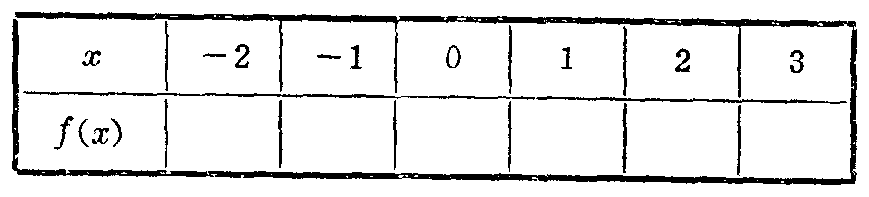
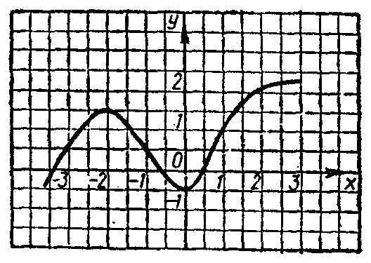

---
{
  "schema": "ld-s10y-lesson/page@3",
  "book": "6a",
  "page": 173,
  "printed_page": 167,
  "source": {
    "pdf": "6a 苏联十年制学校数学教材 代数 六年级.pdf",
    "pdf_sha256": "5bf4fa02c7478d22e88fb1029557fd986e7f1e862d53d449ba96bfc8cf5a3548",
    "pdf_page": 173
  },
  "render": {
    "dpi": 300,
    "w": 1473,
    "h": 2239,
    "sha256": "f9e87f5e183a8566a0ac935cde684842182b05a9c9f57eefcbc9b7f0b269888c"
  },
  "profile": {
    "id": "soviet-cn",
    "sha256": "dad8d974ba16880482f359073263269de8c405ccf8cb17dc4215fad11da44849"
  },
  "notes": [],
  "printed_lines": 14,
  "figures": [
    {
      "id": "tbl-p0173-01",
      "label": "表",
      "box": [
        392,
        612,
        845,
        173
      ]
    },
    {
      "id": "fig-107",
      "label": "图 107",
      "box": [
        571,
        932,
        504,
        351
      ]
    }
  ],
  "provenance": {
    "cap": "1",
    "normalized": true
  }
}
---

<!-- ex 612 cont -->
г）$\frac{6^6}{2^5\cdot3^7}$；　　д）$\frac{5^7\cdot2^9}{10^8}$；　　е）$\frac{10^{12}}{5^6\cdot2^{12}}$．

<!-- exhead -->
复习题

<!-- ex 613 -->
613．图107上画出的是某个函数$y=f(x)$的图象．根据图象填表：

<!-- fig 表 box 392,612,845,173 owner-ex 613 -->

<!-- ex 614 -->
614．直线$y=kx+l$经过点$A(-3,2)$，而且和直线$x-2y=1$
平行．求系数$k$和$l$．

<!-- fig 图 107 box 571,932,504,351 owner-ex 613 -->

<!-- cap 图 107 -->
图　107

<!-- h3 -->
36．两个分式的积

<!-- p open -->
我们知道，两个分式的积是一个分式，它的分子等于两个
已知分式分子的积，它的分母等于两个已知分式分母的积。
因此，等式
$\frac{a}{b}\cdot\frac{c}{d}=\frac{ac}{bd}$，　　　　　　　　　（1）
当变量$a$、$b$、$c$、$d$取任何值（但$b\ne0$，$d\ne0$）时，等式是真等式。
应用等式（1），可以把两个分式的积变形成一个分式。

<!-- foot -->
· 167 ·
