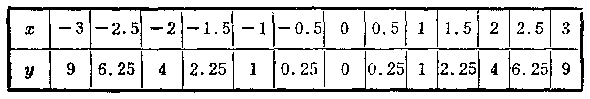

---
{
  "schema": "ld-s10y-lesson/page@3",
  "book": "6a",
  "page": 179,
  "printed_page": 173,
  "source": {
    "pdf": "6a 苏联十年制学校数学教材 代数 六年级.pdf",
    "pdf_sha256": "5bf4fa02c7478d22e88fb1029557fd986e7f1e862d53d449ba96bfc8cf5a3548",
    "pdf_page": 179
  },
  "render": {
    "dpi": 300,
    "w": 1473,
    "h": 2239,
    "sha256": "4b085d2e583fde80c6d73bd52c90fc73c9b62213bb2de106b19422072a3df817"
  },
  "profile": {
    "id": "soviet-cn",
    "sha256": "dad8d974ba16880482f359073263269de8c405ccf8cb17dc4215fad11da44849"
  },
  "notes": [],
  "printed_lines": 23,
  "figures": [
    {
      "id": "tbl-p0179-01",
      "label": "表",
      "box": [
        226,
        1089,
        1100,
        167
      ]
    }
  ],
  "provenance": {
    "cap": "1",
    "normalized": true
  }
}
---

<!-- p cont -->
积等于$b^2$（平方厘米）．所以，正方形表面积等于$6b^2$，即
$S=6b^2$．

<!-- p -->
式$S=6b^2$说明了正方体表面积和棱长的关系：正方体表
面积和它的棱长的平方成正比．

<!-- p -->
在这一小节里，我们将讨论用式$y=ax^2$给出的函数，其
中$a$是不等于零的数，$x$和$y$是变量．

<!-- p -->
对于$x$的任何值来说，$ax^2$总有意义．因此，这个函数的
定义域$X$是所有数的集合，即
$X=]-\infty,+\infty[$．

<!-- p -->
当$a=1$时，式$y=ax^2$变成$y=x^2$的形式．

<!-- p -->
我们来作式$y=x^2$给出的函数的图象．为此我们先列数
值表：

<!-- fig 表 box 226,1089,1100,167 -->

<!-- p -->
如果$x=0$，那么$y=0$．这就是说，图象通过坐标原点．
如果$x\ne0$，那么式$x^2$取正值（正数和负数的偶次幂都是
正数）．

<!-- p -->
因此，函数图象上所有的点，除了点$(0,0)$以外，都在$x$轴
的上方．

<!-- p -->
$x$所取的值为相反数时，对应的$y$值也相等．例如，
$x=-15$时，$y=225$；$x=15$时，$y=225$．这就是说，横坐标
绝对值相等而符号相反的点，相对于$y$轴成对称．点$(0,0)$和
它本身成对称．

<!-- p open -->
我们已经说明了式$y=x^2$给出的函数的图象具有的某些

<!-- foot -->
· 173 ·
