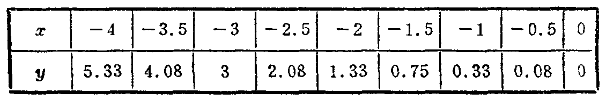
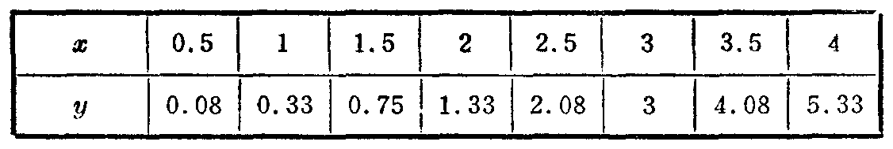
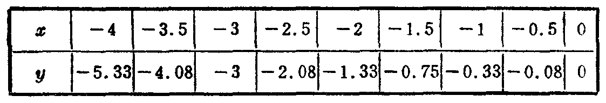
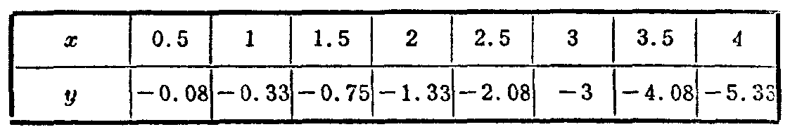

---
{
  "schema": "ld-s10y-lesson/page@3",
  "book": "6a",
  "page": 181,
  "printed_page": 175,
  "source": {
    "pdf": "6a 苏联十年制学校数学教材 代数 六年级.pdf",
    "pdf_sha256": "5bf4fa02c7478d22e88fb1029557fd986e7f1e862d53d449ba96bfc8cf5a3548",
    "pdf_page": 181
  },
  "render": {
    "dpi": 300,
    "w": 1473,
    "h": 2239,
    "sha256": "1f8d5a01ec6af22569d2444362659680e1c08ed72df3aea778252fed39f36e8f"
  },
  "profile": {
    "id": "soviet-cn",
    "sha256": "dad8d974ba16880482f359073263269de8c405ccf8cb17dc4215fad11da44849"
  },
  "notes": [],
  "printed_lines": 11,
  "figures": [
    {
      "id": "tbl-p0181-01",
      "label": "表",
      "box": [
        189,
        525,
        1106,
        166
      ]
    },
    {
      "id": "tbl-p0181-02",
      "label": "表",
      "box": [
        193,
        714,
        1102,
        165
      ]
    },
    {
      "id": "tbl-p0181-03",
      "label": "表",
      "box": [
        201,
        1403,
        1099,
        168
      ]
    },
    {
      "id": "tbl-p0181-04",
      "label": "表",
      "box": [
        204,
        1591,
        1099,
        167
      ]
    }
  ],
  "provenance": {
    "cap": "1",
    "normalized": true
  }
}
---

<!-- p cont -->
象的作图方法．

<!-- p -->
例1． 作式$y=\frac{1}{3}x^2$给出的函数的图象．

<!-- p -->
列表（$y$值取至小数点后两位）：

<!-- fig 表 box 189,525,1106,166 -->

<!-- fig 表 box 193,714,1102,165 -->

<!-- p -->
如果利用式$y=x^2$给出的函数作图时所列的表，只要将
$x^2$的每一个值除以3，就可以很方便地列出上面的表．
按表中所列坐标描点．

<!-- p -->
用光滑的曲线连接各点，就得到式$y=\frac{1}{3}x^2$给出的函数的图象（图111）．

<!-- p -->
例2． 作式$y=-\frac{1}{3}x^2$给出的函数的图象．

<!-- fig 表 box 201,1403,1099,168 -->

<!-- fig 表 box 204,1591,1099,167 -->

<!-- p -->
首先列表．这里可以利用作式$y=\frac{1}{3}x^2$给出的函数的图
象时所列的表，只要将$y$值的符号改成相反的符号就行了．

<!-- foot -->
· 175 ·
