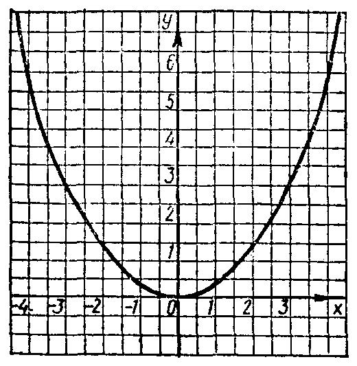
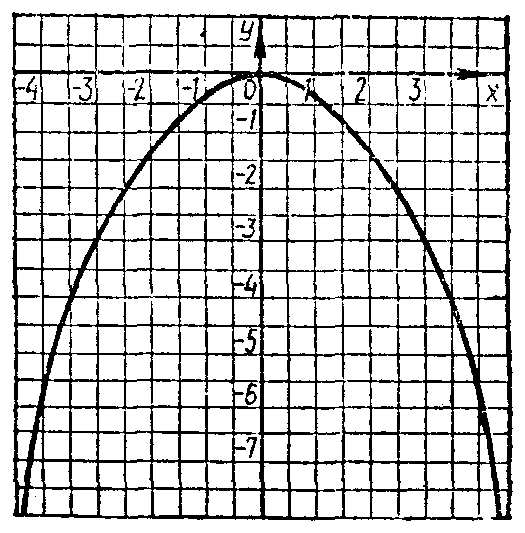
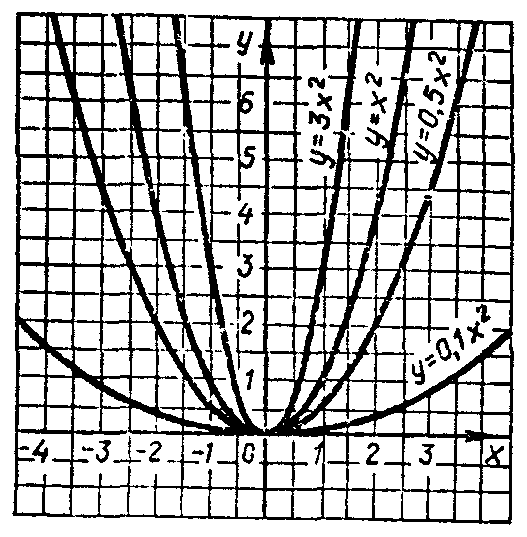
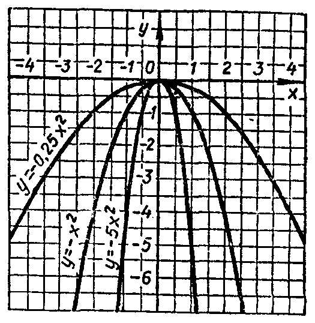

---
{
  "schema": "ld-s10y-lesson/page@3",
  "book": "6a",
  "page": 182,
  "printed_page": 176,
  "source": {
    "pdf": "6a 苏联十年制学校数学教材 代数 六年级.pdf",
    "pdf_sha256": "5bf4fa02c7478d22e88fb1029557fd986e7f1e862d53d449ba96bfc8cf5a3548",
    "pdf_page": 182
  },
  "render": {
    "dpi": 300,
    "w": 1473,
    "h": 2239,
    "sha256": "6ecef1cc2b4c4156892da47b4bb6be5232d61d019e28bb20f1f37e2a3e3bf4e4"
  },
  "profile": {
    "id": "soviet-cn",
    "sha256": "dad8d974ba16880482f359073263269de8c405ccf8cb17dc4215fad11da44849"
  },
  "notes": [],
  "printed_lines": 9,
  "figures": [
    {
      "id": "fig-111",
      "label": "图 111",
      "box": [
        240,
        252,
        496,
        509
      ]
    },
    {
      "id": "fig-112",
      "label": "图 112",
      "box": [
        807,
        255,
        501,
        509
      ]
    },
    {
      "id": "fig-113",
      "label": "图 113",
      "box": [
        235,
        1374,
        503,
        513
      ]
    },
    {
      "id": "fig-114",
      "label": "图 114",
      "box": [
        813,
        1372,
        501,
        514
      ]
    }
  ],
  "provenance": {
    "cap": "1",
    "normalized": true
  }
}
---

<!-- fig 图 111 box 240,252,496,509 -->

<!-- cap 图 111 -->
图 111

<!-- fig 图 112 box 807,255,501,509 -->

<!-- cap 图 112 samerow -->
图 112

<!-- p -->
按表中所列坐标描点，并用光滑的曲线连结各点，就得到
式$y=-\frac{1}{3}x^2$给出的函数的图象（图112）．

<!-- p -->
所作函数的图象和式$y=\frac{1}{3}x^2$给出的函数的图象，对于
$x$轴成对称．

<!-- p -->
图113和114画出了式$y=ax^2$（当$a$取各种值时）给出的
函数的图象．这种曲线叫做抛物线．

<!-- fig 图 113 box 235,1374,503,513 -->

<!-- cap 图 113 -->
图 113

<!-- fig 图 114 box 813,1372,501,514 -->

<!-- cap 图 114 samerow -->
图 114

<!-- foot -->
· 176 ·
