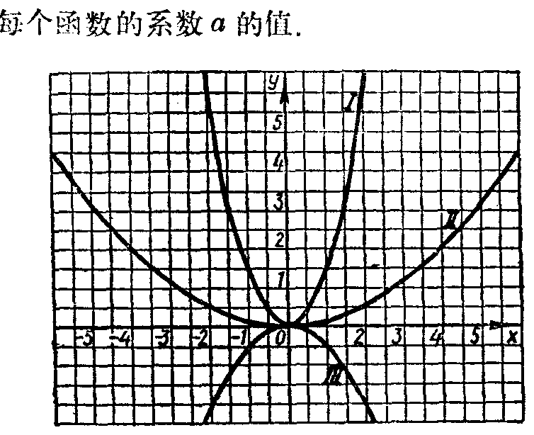

---
{
  "schema": "ld-s10y-lesson/page@3",
  "book": "6a",
  "page": 185,
  "printed_page": 179,
  "source": {
    "pdf": "6a 苏联十年制学校数学教材 代数 六年级.pdf",
    "pdf_sha256": "5bf4fa02c7478d22e88fb1029557fd986e7f1e862d53d449ba96bfc8cf5a3548",
    "pdf_page": 185
  },
  "render": {
    "dpi": 300,
    "w": 1473,
    "h": 2239,
    "sha256": "4429ba4b02a95633b19d5be7c44ab4d880548e48659fd329926cba88768c0af4"
  },
  "profile": {
    "id": "soviet-cn",
    "sha256": "dad8d974ba16880482f359073263269de8c405ccf8cb17dc4215fad11da44849"
  },
  "notes": [],
  "printed_lines": 14,
  "figures": [
    {
      "id": "fig-115",
      "label": "图 115",
      "box": [
        396,
        573,
        730,
        590
      ]
    }
  ],
  "provenance": {
    "cap": "1",
    "normalized": true
  }
}
---

<!-- ex 640 cont -->
б）要使圆的面积扩大为9倍或者缩小为二十五分之
一，它的半径应当怎样变化？
в）如果圆的半径从$10\mathrm{cm}$扩大到$20\mathrm{cm}$，它的面积怎样
变化？

<!-- ex 641 -->
641．图115中画出了式$y=ax^2$给出的几个函数的图象．求
出每个函数的系数$a$的值．

<!-- fig 图 115 box 396,573,730,590 -->

<!-- cap 图 115 -->
图　115

<!-- exhead -->
复习题

<!-- ex 642 -->
642．利用图象解方程组：
а）$\begin{cases}y=x^2,\\y-2x-3=0;\end{cases}$　　　　　　б）$\begin{cases}y=x^2,\\x+y=6,\\y-x=2.\end{cases}$

<!-- ex 643 -->
643．а）$5^7$和б）$3^{10}$各有几个约数？

<!-- ex 644 -->
644．计算：
а）$\frac{8^{15}}{4^{22}}$；　　　　　　　　　б）$\frac{(-9)^{27}}{(-27)^{18}}$．

<!-- foot -->
· 179 ·
