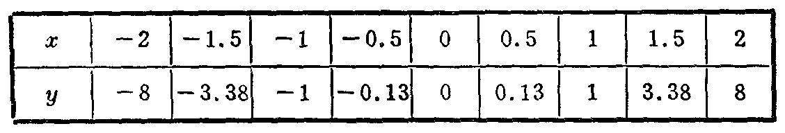

---
{
  "schema": "ld-s10y-lesson/page@3",
  "book": "6a",
  "page": 186,
  "printed_page": 180,
  "source": {
    "pdf": "6a 苏联十年制学校数学教材 代数 六年级.pdf",
    "pdf_sha256": "5bf4fa02c7478d22e88fb1029557fd986e7f1e862d53d449ba96bfc8cf5a3548",
    "pdf_page": 186
  },
  "render": {
    "dpi": 300,
    "w": 1473,
    "h": 2239,
    "sha256": "e540841d846e14488912f14837583052f9dac241e17e07d1e69077d632db7216"
  },
  "profile": {
    "id": "soviet-cn",
    "sha256": "dad8d974ba16880482f359073263269de8c405ccf8cb17dc4215fad11da44849"
  },
  "notes": [],
  "printed_lines": 22,
  "figures": [
    {
      "id": "tbl-p0186-01",
      "label": "表",
      "box": [
        160,
        882,
        1104,
        168
      ]
    }
  ],
  "provenance": {
    "cap": "1",
    "normalized": true
  }
}
---

<!-- h3 -->
40．式$y=ax^3$给出的函数及其图象

<!-- p -->
现在我们来讨论式$y=ax^3$给出的函数，其中$a$是不等于
零的数，$x$和$y$是变量．
因为对于$x$取任何值来说，式$ax^3$总有意义，所以这个函
数的定义域是所有数的集合．
当$a=1$时，式$y=ax^3$变成$y=x^3$．
下面我们来作式$y=ax^3$给出的函数的图象．
列表（其中有些函数值是近似值）：

<!-- fig 表 box 160,882,1104,168 -->

<!-- p -->
当$x=0$时，$y=0$，所以这个函数的图象经过坐标原点．
当$x$取正值时，对应的$y$也取正值，而当$x$取负值时，对
应的$y$也取负值．例如，当$x=4$时，$y=64$；当$x=-6$时，
$y=-216$．
因此，函数的图象在第一和第三象限里．
当$x$取相反的数值时，对应的$y$也取相反的数值．例如，
当$x=5$时，$y=125$；当$x=-5$时，$y=-125$．因此，图象上的
点关于坐标原点成对称．
在坐标平面上按表中所列坐标描点．用光滑的曲线连结
所描的点，就得到式$y=x^3$给出的函数的图象（图116）．
当$a$取其他值（$a\ne0$）时，式$y=ax^3$给出的函数的图象，
可以用同样方法作出．

<!-- p open -->
图117和118中画出了式$y=ax^3$（当$a$取不同的值时）给

<!-- foot -->
· 180 ·
