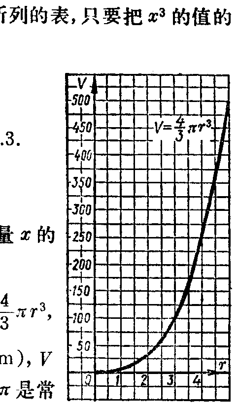

---
{
  "schema": "ld-s10y-lesson/page@3",
  "book": "6a",
  "page": 188,
  "printed_page": 182,
  "source": {
    "pdf": "6a 苏联十年制学校数学教材 代数 六年级.pdf",
    "pdf_sha256": "5bf4fa02c7478d22e88fb1029557fd986e7f1e862d53d449ba96bfc8cf5a3548",
    "pdf_page": 188
  },
  "render": {
    "dpi": 300,
    "w": 1473,
    "h": 2239,
    "sha256": "bd2a0b3c3539171dd99af53befc06e645217e3be1d8300457cfb2d5a72097e95"
  },
  "profile": {
    "id": "soviet-cn",
    "sha256": "dad8d974ba16880482f359073263269de8c405ccf8cb17dc4215fad11da44849"
  },
  "notes": [],
  "printed_lines": 27,
  "figures": [
    {
      "id": "fig-119",
      "label": "图 119",
      "box": [
        785,
        1090,
        459,
        804
      ]
    }
  ],
  "provenance": {
    "cap": "1",
    "normalized": true
  }
}
---

<!-- ex 645 cont -->
б）对应于$y=3，-3$的$x$值．

<!-- ex 646 -->
646．利用式$y=x^3$给出的函数$f$的图象（图116）：
а）当$x=1.3，x=1.4，x=1.8$时，求式$x^3$的值（用计算结
果进行检验）；
б）比较下列函数值的大小：$f(1)$和$f(1.2)，f(1.4)$和
$f(1.2)，f(-1)$和$f(0)，f(0)$和$f(1)；f(x_1)$和
$f(x_2)$，其中$x_1$和$x_2$是任意的数，且$x_1<x_2$．
в）当式$x^3$等于8或等于$-5$时，求$x$的值．

<!-- ex 647 -->
647．а）如果正方体的棱长扩大为2倍或者缩小为十分之一
时，正方体的体积怎样变化？
б）要使正方体的体积扩大27倍或者缩小125倍，它的
棱长应当怎样变化？

<!-- ex 648 -->
648．作式$y=-x^3$给出的函数的图象（作图时可以利用作式
$y=x^3$给出的函数的图象时所列的表，只要把$x^3$的值的
符号改成相反的符号）．
利用所作图象，求：
а）对应于下列$x$值的$y$值：
$x=0.7，-0.7，1.3，-1.3$．
б）对应下列$y$值的$x$值：
$y=4，-4$．
в）当$y=0，y<0，y>0$时变量$x$的
值的集合．

<!-- ex 649 open -->
649．球的体积的计算公式是$V=\frac{4}{3}\pi r^3$，
其中$r$是球的半径（单位：$\mathrm{cm}$），$V$
是球的体积（单位：$\mathrm{cm}^3$），$\pi$是常
数，约等于3.14．

<!-- fig 图 119 box 785,1090,459,804 -->

<!-- cap 图 119 samerow -->
图　119

<!-- foot -->
· 182 ·
