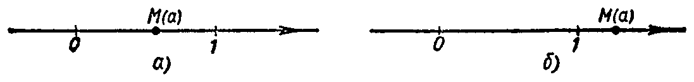

---
{
  "schema": "ld-s10y-lesson/page@3",
  "book": "6a",
  "page": 198,
  "printed_page": 192,
  "source": {
    "pdf": "6a 苏联十年制学校数学教材 代数 六年级.pdf",
    "pdf_sha256": "5bf4fa02c7478d22e88fb1029557fd986e7f1e862d53d449ba96bfc8cf5a3548",
    "pdf_page": 198
  },
  "render": {
    "dpi": 300,
    "w": 1473,
    "h": 2239,
    "sha256": "9255c620237a1f0a4ee9a84828fe75533f97cc55eb787cc34f61f704efd9ce49"
  },
  "profile": {
    "id": "soviet-cn",
    "sha256": "dad8d974ba16880482f359073263269de8c405ccf8cb17dc4215fad11da44849"
  },
  "notes": [],
  "printed_lines": 17,
  "figures": [
    {
      "id": "fig-120",
      "label": "图 120",
      "box": [
        162,
        919,
        1073,
        107
      ]
    }
  ],
  "provenance": {
    "cap": "1",
    "normalized": true
  }
}
---

<!-- ex 714 cont -->
в）$y=25x$；　　　　г）$y=25|x|$．

<!-- ex 715 -->
715．在同一个坐标系里作式 $y=x$、$y=x^2$、$y=x^3$（$x\in[0,2]$）
给出的函数的图象．利用所作图象，比较下列两数的
大小：
а）$0.23$ 和 $(0.23)^2$；　　　　б）$0.23$ 和 $(0.23)^3$；
в）$(0.23)^2$ 和 $(0.23)^3$；　　г）$1.47$ 和 $(1.47)^2$；
д）$1.47$ 和 $(1.47)^3$；　　　　е）$(1.47)^2$ 和 $(1.47)^3$．

<!-- ex 716 -->
716*．在图120а 和120б 上画出了点 $M(a)$ 在数轴上的位置．
在这条数轴上指出点 $B(a^2)$、$C(a^3)$、$A(-a)$ 的大致
位置．

<!-- fig 图 120 box 162,919,1073,107 -->

<!-- cap 图 120 -->
图　120

<!-- ex 717 -->
717*．用式 $y=x^3$ 给出一个函数，定义域是 $X=[-2,2.1]$．按
递增的顺序，依次求出这个函数所有的整数值．指出这
个函数的最小值和最大值．

<!-- ex 718 -->
718*．式 $y=x^3$ 给出的函数的定义域是某个区间 $[b,c]$，而值
域是区间 $[-8,125]$．求这个函数的定义域．

<!-- foot -->
· 192 ·
