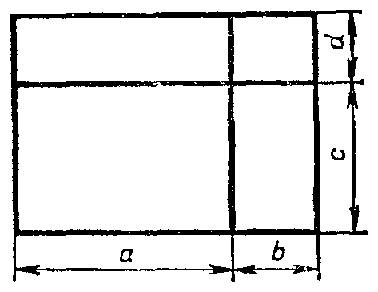

---
{
  "schema": "ld-s10y-lesson/page@3",
  "book": "6a",
  "page": 230,
  "printed_page": 224,
  "source": {
    "pdf": "6a 苏联十年制学校数学教材 代数 六年级.pdf",
    "pdf_sha256": "5bf4fa02c7478d22e88fb1029557fd986e7f1e862d53d449ba96bfc8cf5a3548",
    "pdf_page": 230
  },
  "render": {
    "dpi": 300,
    "w": 1473,
    "h": 2239,
    "sha256": "34fced87737f148246f465bd40f750be3a94b73bba8d12022e83aa8952ca457a"
  },
  "profile": {
    "id": "soviet-cn",
    "sha256": "dad8d974ba16880482f359073263269de8c405ccf8cb17dc4215fad11da44849"
  },
  "notes": [],
  "printed_lines": 24,
  "figures": [
    {
      "id": "fig-124",
      "label": "图 124",
      "box": [
        781,
        1544,
        449,
        342
      ]
    }
  ],
  "provenance": {
    "cap": "1",
    "normalized": true
  }
}
---

<!-- ex 823 -->
823．证明下列两式恒等：
а) $(x-y)+(y-z)-(x-z)$ 和 $0$；
б) $a(b-c)+b(a-c)+c(a+b)$ 和 $2ab$．

<!-- h2 -->
§ 16．多项式的积

<!-- h3 -->
50．把两个多项式的积变换成标准形式的多项式

<!-- p -->
应用乘法分配律，可以把任意两个多项式的积化成一个
多项式．

<!-- p -->
例如，要把二项式 $(a+b)$ 与 $(c+d)$ 的积化成一个多项式．
我们用字母 $x$ 表示二项式 $a+b$．这时，式 $(a+b)(c+d)$
变成 $x(c+d)$．
去括号，得恒等式：
$x(c+d)=xc+xd$．　　　　　　　　　$(1)$
把式 $a+b$ 代替恒等式（1）中的变量 $x$，得到新的恒等式：
$(a+b)(c+d)=(a+b)c+(a+b)d$．　　　　$(2)$
在等式右边去括号，得到与积 $(a+b)(c+d)$ 恒等的多项
式：
$(a+b)(c+d)=ac+bc+ad+bd$．　　　　　$(3)$

<!-- p -->
图 124 上给出了恒等式（3）的几
何表示．

<!-- fig 图 124 box 781,1544,449,342 -->

<!-- cap 图 124 samerow -->
图　124

<!-- p -->
我们看到，两个二项式的积
恒等于一个二项式的各项与另
一个二项式每一项的积之和．

<!-- p open -->
可以证明，对于两个任意多

<!-- foot -->
· 224 ·
