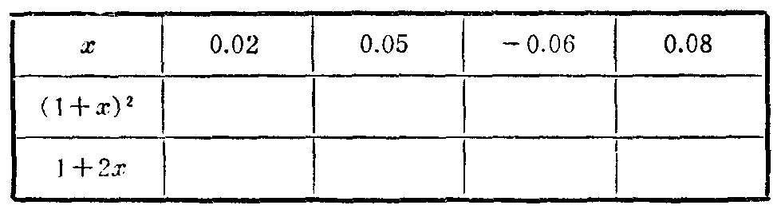

---
{
  "schema": "ld-s10y-lesson/page@3",
  "book": "6a",
  "page": 250,
  "printed_page": 244,
  "source": {
    "pdf": "6a 苏联十年制学校数学教材 代数 六年级.pdf",
    "pdf_sha256": "5bf4fa02c7478d22e88fb1029557fd986e7f1e862d53d449ba96bfc8cf5a3548",
    "pdf_page": 250
  },
  "render": {
    "dpi": 300,
    "w": 1473,
    "h": 2239,
    "sha256": "3b9aa9bf0c9f3ee151e7c76940249e4c138291e21ea82effbf6100bfb805e28c"
  },
  "profile": {
    "id": "soviet-cn",
    "sha256": "dad8d974ba16880482f359073263269de8c405ccf8cb17dc4215fad11da44849"
  },
  "notes": [],
  "printed_lines": 22,
  "figures": [
    {
      "id": "tbl-p0250-01",
      "label": "表",
      "box": [
        244,
        530,
        955,
        243
      ]
    }
  ],
  "provenance": {
    "cap": "1",
    "normalized": true
  }
}
---

<!-- ex 899 cont -->
в）$(x+y)^2-(x-y)^2=4xy$；
г）$(2mn)^2+(m^2-n^2)^2=(m^2+n^2)^2$．

<!-- ex 900 open -->
900．填表（式 $(1+x)^2$ 的值用四舍五入法取到小数点后两
位）：

<!-- fig 表 box 244,530,955,243 owner-ex 900 -->

<!-- ex 900 cont -->
对于列出的每一个 $x$ 值，求出式子 $(1+x)^2$ 与 $1+2x$ 的
相应值的差．

<!-- ex 901 -->
901．对于接近 1 的数的平方，为了求出它的近似值，有时应
用公式 $(1+a)^2\approx1+2a$，其中 $|a|$ 是比 1 小得多的数．
应用这个公式求下列各式的近似值：
а）$(1+0.01)^2$；　　б）$(1+0.02)^2$；　　в）$1.05^2$；
г）$1.005^2$；　　　д）$(1-0.03)^2$；　　е）$0.999^2$．

<!-- ex 902 -->
902．当 $x$ 是什么值时，
а）二项式 $x+1$ 的平方比二项式 $x-3$ 的平方大 120？
б）二项式 $x+2$ 与 $x-2$ 的积的两倍比这两个二项式的
平方和小 16？

<!-- ex 903 -->
903．已知多项式 $x^2-5x+8$．先把下式：
а）$x=y+1$；　　　　　　　　　б）$x=2y-3$
代入多项式，再把得到的含有变量 $y$ 的式子变换成标准
形式的多项式．

<!-- exhead -->
复　习　题

<!-- ex 904 open -->
904．解方程：

<!-- foot -->
· 244 ·
