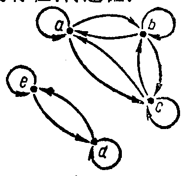

---
{
  "schema": "ld-s10y-lesson/page@3",
  "book": "6a",
  "page": 255,
  "printed_page": 249,
  "source": {
    "pdf": "6a 苏联十年制学校数学教材 代数 六年级.pdf",
    "pdf_sha256": "5bf4fa02c7478d22e88fb1029557fd986e7f1e862d53d449ba96bfc8cf5a3548",
    "pdf_page": 255
  },
  "render": {
    "dpi": 300,
    "w": 1473,
    "h": 2239,
    "sha256": "ada9475f5e359acb6a8ad5806353edcf9e7726bf3f6ae1fb3f3d5f60849df62d"
  },
  "profile": {
    "id": "soviet-cn",
    "sha256": "dad8d974ba16880482f359073263269de8c405ccf8cb17dc4215fad11da44849"
  },
  "notes": [
    "图 127 的图题与第 927 题正文在同一印刷行，samerow 用于行投影对账。"
  ],
  "printed_lines": 26,
  "figures": [
    {
      "id": "fig-127",
      "label": "图 127",
      "box": [
        967,
        677,
        353,
        332
      ]
    }
  ],
  "provenance": {
    "cap": "1",
    "normalized": true
  }
}
---

<!-- h3 -->
第五章　补充习题

<!-- exhead -->
第41小节

<!-- ex 925 -->
925．集合$A=\{2,3,5,8,9,16\}$各元素之间的关系$g$，是由语
句“$x$是$y$的约数（$x\in A,y\in A$）”给出的。用箭头表示这
个关系。关系$g$有没有自反性、对称性、传递性？

<!-- ex 926 -->
926．集合$\{a,b,c,d,e\}$各元素之间
的关系是用箭头表示的（图
127）。这个关系是不是自反的、
对称的、传递的？

<!-- fig 图 127 box 967,677,353,332 -->

<!-- cap 图 127 samerow -->
图　127

<!-- ex 927 -->
927．已知关系$h$有自反性、对称性、
传递性，并且元素2和元素3有
关系$h$。再指出有关系$h$的三对元素。

<!-- ex 928 -->
928．集合$\{3,5,7,8\}$各元素之间给出了“小于”关系。用列数
对的方法表示这个关系，并且作出图来。这个关系有什
么性质（自反性、对称性、传递性）？

<!-- ex 929 -->
929．有理数集合$Q$各元素之间的关系，是由下列命题给
出的：
а）$ab=12$，其中$a\in Q$，$b\in Q$；
б）$a+b=0$，其中$a\in Q$，$b\in Q$。
这个关系有没有自反性、对称性、传递性？

<!-- ex 930 -->
930*．有理数集合$Q$各元素之间的关系$h$，是这样叙述的：“如
果$a-b$是整数，那么元素$a$和元素$b$有关系$h$”。
а）证明关系$h$是等价关系；
б）指出与5有关系$h$的几个数；
в）指出与3.7有关系$h$的几个正数与几个负数。

<!-- foot -->
· 249 ·
